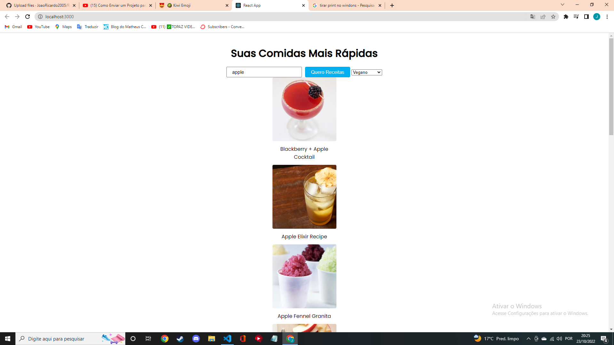
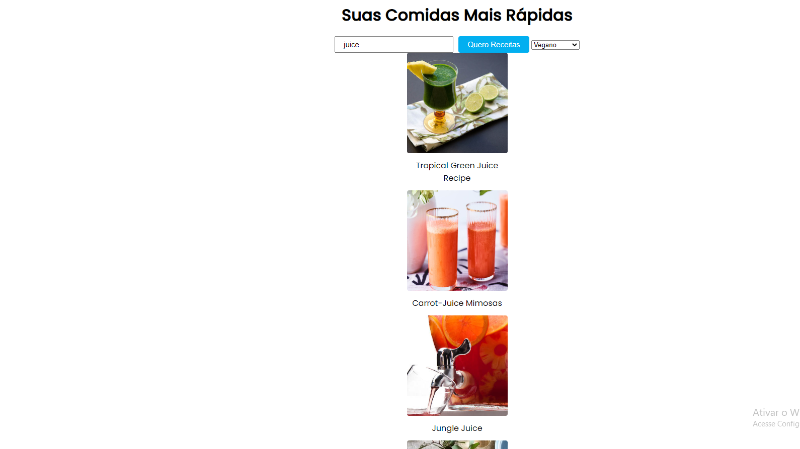

## Site Receitas 🥝

### Um site que permite você pesquisar qualquer tipo de comida ou bebida e o mesmo retorna diversos tipos de receitas com essa comida
## Algumas Telas Da Aplicação

## 🚀Tecnologias Usadas

### esse projeto foi feito consumindo uma api e utilzei as seguintes linguagens:

 

## Instalação 😀 

#### Clone o Projeto Com:  

git clone https://github.com/JoaoRicardo2005/Receitas
#### Entre na pasta e instale as dependências com: 
 Yarn
#### Com tudo correto você pode iniciar o servidor com:
yarn start
#### Se você estiver no ambiente de desenvolvimento, poderá usar o servidor de desenvolvimento:
yarn dev 
yarn queue
## Importante 💛

### a aplicação foi totalmente feita por mim joão ricardo mas você pode usar ela do jeito que preferir! seja para estudo,apoio nos estudos ou até para ganhar dinheiro quem sabe rsrs. entre em contato em joaobarbanti7@gmail.com.

